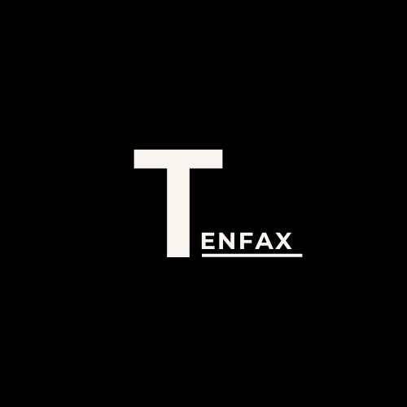

# Tenfax Dashboard

<!-- PROJECT LOGO -->
<br />
<div align="center">
  <a href="https://github.com/CarltonOsinde/Tenfax-Dashboard">
    
  </a>

<h3 align="center">Tenfax Dashboard</h3>

  <p align="center">
   Connecting sales data to a dashboard
    <br />
    <a href="https://github.com/CarltonOsinde/Tenfax-Dashboard"><strong>Explore the docs »</strong></a>
    <br />
    <br />
    <a href="https://github.com/CarltonOsinde/Tenfax-Dashboard">View Demo</a>
    ·
    <a href="https://github.com/CarltonOsinde/Tenfax-Dashboard/issues">Report Bug</a>
    ·
    <a href="https://github.com/CarltonOsinde/Tenfax-Dashboard/issues">Request Feature</a>
  </p>
</div>


<!-- TABLE OF CONTENTS -->
<details>
  <summary>Table of Contents</summary>
  <ol>
    <li>
      <a href="#about-the-project">About The Project</a>
      <ul>
        <li><a href="#built-with">Built With</a></li>
      </ul>
    </li>
    <li>
      <a href="#getting-started">Getting Started</a>
      <ul>
        <li><a href="#prerequisites">Prerequisites</a></li>
        <li><a href="#installation">Installation</a></li>
      </ul>
    </li>
    <li><a href="#contributing">Contributing</a></li>
    <li><a href="#contact">Contact</a></li>
  </ol>
</details>


<!-- ABOUT THE PROJECT -->
## About The Project
<a href="https://github.com/CarltonOsinde/Tenfax-Dashboard">
    
</a>

This is a React dashboard that connects to a MongoDB database through a Node.js server written and processes data and insights.


### Built With

#### MERN Stack
* Mongo DB
* Express.js
* React.js
* Node.js


<!-- USAGE EXAMPLES -->
## Demo

Screenshots, code examples and demos will be added in this space. Stay tuned.


<!-- GETTING STARTED -->
## Getting Started

This is an example of how you may give instructions on setting up your project locally.
To get a local copy up and running follow these simple example steps.

### Prerequisites

This is an example of how to list things you need to use the software and how to install them.
* npm
  ```sh
  npm install npm@latest -g
  ```

### Installation

1. Clone the repo
   ```sh
   git clone https://github.com/CarltonOsinde/Tenfax-Dashboard.git
   ```
2. Install NPM packages
   ```sh
   npm install
   ```
3. Good to code!


<!-- CONTRIBUTING -->
## Contributing

Contributions are what make the open source community such an amazing place to learn, inspire, and create. Any contributions you make are **greatly appreciated**.

If you have a suggestion that would make this better, please fork the repo and create a pull request. You can also simply open an issue with the tag "enhancement".
Don't forget to give the project a star! Thanks again!

1. Fork the Project
2. Create your Feature Branch (`git checkout -b feature/AmazingFeature`)
3. Commit your Changes (`git commit -m 'Add some AmazingFeature'`)
4. Push to the Branch (`git push origin feature/AmazingFeature`)
5. Open a Pull Request


<!-- CONTACT -->
## Contact

 [LinkedIn](https://linkedin/in/carltonosinde/) - [Email](carltonosinde@gmail.com) - [Website](https://carltonosinde.com)


<!-- ACKNOWLEDGMENTS
## Acknowledgments

* []()
* []()
* []()

-->
